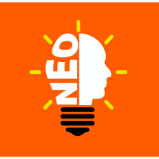

<!--
**afrozchakure/afrozchakure** is a ✨ _special_ ✨ repository because its `README.md` (this file) appears on your GitHub profile.

Here are some ideas to get you started:

- 🔭 I’m currently working on ...
- 🌱 I’m currently learning ...
- 👯 I’m looking to collaborate on ...
- 🤔 I’m looking for help with ...
- 💬 Ask me about ...
- 📫 How to reach me: ...
- 😄 Pronouns: ...
- ⚡ Fun fact: ...
-->
### **Let's do a challenge (Find the Hidden Code):**
    

#### **Did you break the code ??**
  
**Hint:** Examine the Laptop.

### **About me:**  
- A Tech Blogger 👨‍💻 and Microsoft Student Partner 👨‍🎓
- Book Lover with interest in Artificial Intelligence 🤖📚  

### **Skills :**  
Python 🐍 / Machine Learning 💻 / Deep Learning / JavaScript / Blogging 💖

- 🔭 Currently working on Deep Learning and Computer Vision 
- 🌱 Currently learning Tensorflow and Keras 
- 👯 Looking to collaborate on any Machine Learning project. 
- 💬 Ask me about Best Books to read.  
- 📫 How to reach me: aaaanchakure@gmail.com 
- 😄 Pronouns: **He / His / Him** 
- ⚡ Fun fact: Can touch type @ 60+ WPM.

### **My Internet Profiles :**   
  
        

### **Past organizations I have Represented and Volunteered for :**
&section=position%3A1506416247&treasuryCount=3) &section=position%3A1514135452&treasuryCount=2) &section=position%3A1472338911&treasuryCount=3)
&section=position%3A1595741865&treasuryCount=2)  &section=position%3A1584257400&treasuryCount=5)  &section=position%3A1617256397&treasuryCount=1)  

### **Github Stats**

    
